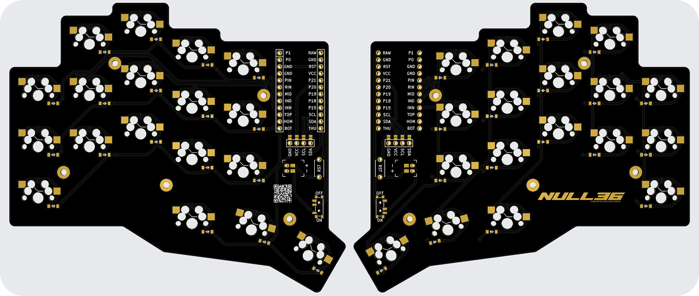
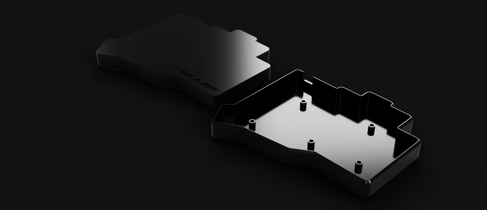

<picture align="center">
    
</picture>

<h1 align="center">null36</h1>

36-Key wireless split ortho column-staggered MX keyboard. Controlled by any Nice!Nano V2 compatible MCU, and support for SSD1306 OLED displays.

# Layout

# PCB

[/pcbs](./pcbs)
> This PCB is reversible. When assembling, solder together the pads above the OLED display header, the pads next to the battery jack (the jack goes on the underside of the pcb)

# Case

[/cases](./cases)

# Photos

Work in progress
