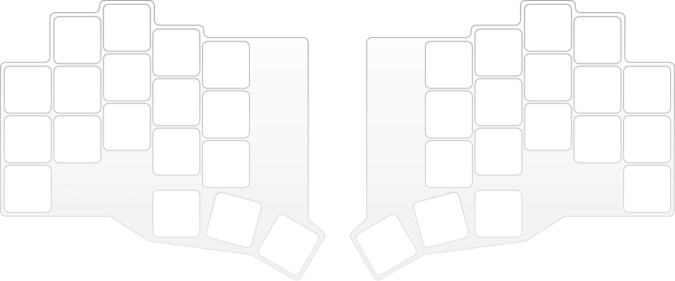

<picture align="center">
    
</picture>

<h1 align="center">null36</h1>

36-Key wireless split ortho column-staggered MX keyboard. Controlled by any Nice!Nano V2 compatible MCU, and support for SSD1306 OLED displays.

# Layout

# PCB

You can find the custom designed PCB [here](./pcbs)

# Case

You can use the board without a case, but [here](./cases) is a minimal design that I use.

# Photos

Work in progress
